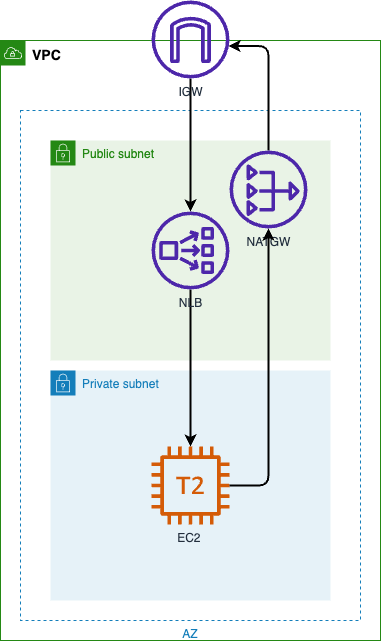

## Preserving Client IP Address with Proxy Protocol v2 and Network Load Balancer

Deploy the CloudFormation template of your choice, either NGINX or HAproxy. The template will deploy the following infrastructure:

In summary, this template sets up all the networking and deploys a simple web application that can demonstrate receiving client details from the Proxy protocol v2 headers when traffic is load balanced by a Network Load Balancer.

Some key things the template is doing:

•	It is creating a VPC, public and private subnets, an internet gateway, a NAT gateway, and associated routing tables to allow access to the internet from the private subnet.
•	An Amazon EC2 security group is defined that will allow ingress on port 80 from the Network Load Balancer.
•	An AWS Identity and Access Management (IAM) role and instance profile are created to allow the EC2 instance access to AWS Systems Manager for remote access.
•	An EC2 instance is launched in the private subnet with a CloudFormation init configuration that will install and configure NGINX or HAProxy and PHP-FPM. The configuration defines a listener on port 80 that supports Proxy protocol v2 and passes requests to PHP-FPM.
•	Index.php displays the client source IP and port found in the Proxy protocol v2 headers passed from the Network Load Balancer. It also shows the client and server software used to establish the connection.

## Security

See [CONTRIBUTING](CONTRIBUTING.md#security-issue-notifications) for more information.

## License

This library is licensed under the MIT-0 License. See the LICENSE file.

